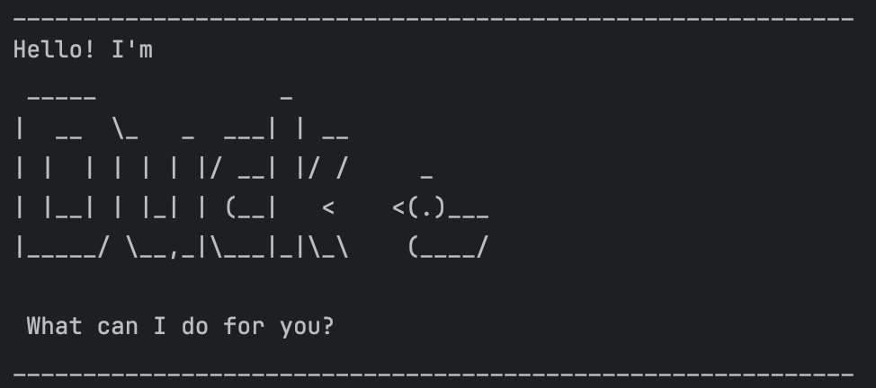

# Duck User Guide



An all-in-one tool to keep your ducks in a line :V </br>
Duck is a **desktop app for managing tasks, optimised for use via a Command Line Interface** (CLI)

## Features
<details>

<summary><strong>Some notes</strong></summary>
<div markdown="1">

### Syntax within this document

Parameters for a command are labelled in ALL_CAPS (e.g., `todo NAME`), which can be replaced with whatever the user deems fit (`todo urmom`).
Optional parameters are surrounded by square brackets `[]` (e.g., `[TIME]`).

### Datetime formats

For `deadline` and `event` that take in datetime arguments in the general form: `DATE [TIME]`.\
The following are the accepted formats:

#### Date
- `dd/MM/yyyy`
- `dd/MM/yy`

#### Time
- `HH:mm`
- `HHmm`

</div>
</details>

---
### Listing tasks: `list`
Displays the current working task list. Additional arguments (e.g., `urmom` in `list urmom`) will be ignored.

Example: `list`

```
  _____________________________________  
 /                                     \
|   Here are the tasks in your list:    |
 \                                     /
  __________________________________  /
                                    \/
                                   _
                                 >(.)___
                                  (____/
____________________________________________________________
1. [T][ ] make a task
2. [D][ ] complete task (by: Mar 12 2025 23:59)
3. [E][ ] making tasklist (from: Mar 12 2025 09:00, to: Mar 12 2025 11:00)
____________________________________________________________
```

---
### Adding tasks

#### Adding todos: `todo NAME`
Adds a task of type 'todo' that contains 
  - task title

Example: `todo make a task` 

```
  ____________________________________________________  
 /                                                    \
|   Got it. I've added this task: [T][ ] make a task   |
 \                                                    /
  _________________________________________________  /
                                                   \/
                                                  _
                                                >(.)___
                                                 (____/
____________________________________________________________
```

#### Adding deadlines: `deadline NAME /by DEADLINE`
Adds a task of type 'deadline' that contains 
  - task title
  - `deadline`: deadline of tasks

Example: `deadline complete task /by 12/03/25 23:59`

```
  ______________________________________________________________________________  
 /                                                                              \
|   Got it. I've added this task: [D][ ] complete task (by: Mar 12 2025 23:59)   |
 \                                                                              /
  ___________________________________________________________________________  /
                                                                             \/
                                                                            _
                                                                          >(.)___
                                                                           (____/
____________________________________________________________
```

#### Adding events: `events NAME /from START /to END`
Adds a task of type 'todo' that contains
  - task title
  - `from`: datetime that the event starts
  - `to`: datetime that the event ends

Example: `event making tasklist /from 12/03/25 09:00 /to 12/03/25 11:00` 

```
  _________________________________________________________________________________________________________  
 /                                                                                                         \
|   Got it. I've added this task: [E][ ] making tasklist (from: Mar 12 2025 09:00, to: Mar 12 2025 11:00)   |
 \                                                                                                         /
  ______________________________________________________________________________________________________  /
                                                                                                        \/
                                                                                                       _
                                                                                                     >(.)___
                                                                                                      (____/
____________________________________________________________
```

---
### Removing tasks: `delete TASK_ID`
Removes task at index `TASK_ID` from the list. 

Example: `delete 1`

```
  ______________________________________________  
 /                                              \
|   I've deleted this task: [T][ ] make a task   |
 \                                              /
  ___________________________________________  /
                                             \/
                                            _
                                          >(.)___
                                           (____/
____________________________________________________________
  _____________________________________  
 /                                     \
|   Now you have 2 tasks in the list.   |
 \                                     /
  __________________________________  /
                                    \/
                                   _
                                 >(.)___
                                  (____/
____________________________________________________________
list
  _____________________________________  
 /                                     \
|   Here are the tasks in your list:    |
 \                                     /
  __________________________________  /
                                    \/
                                   _
                                 >(.)___
                                  (____/
____________________________________________________________
1. [D][ ] complete task (by: Mar 12 2025 23:59)
2. [E][ ] making tasklist (from: Mar 12 2025 09:00, to: Mar 12 2025 11:00)
____________________________________________________________
```

---
### Marking task status

#### Marking tasks as done: `mark TASK_ID`
Marks task at index `TASK_ID` as complete.

Example: `mark 2` followed by `list`

```
  ________________________________________________________________________________________________________________  
 /                                                                                                                \
|   Nice! I've marked this task as done: [E][X] making tasklist (from: Mar 12 2025 09:00, to: Mar 12 2025 11:00)   |
 \                                                                                                                /
  _____________________________________________________________________________________________________________  /
                                                                                                               \/
                                                                                                              _
                                                                                                            >(.)___
                                                                                                             (____/
____________________________________________________________
list
  _____________________________________  
 /                                     \
|   Here are the tasks in your list:    |
 \                                     /
  __________________________________  /
                                    \/
                                   _
                                 >(.)___
                                  (____/
____________________________________________________________
1. [D][ ] complete task (by: Mar 12 2025 23:59)
2. [E][X] making tasklist (from: Mar 12 2025 09:00, to: Mar 12 2025 11:00)
____________________________________________________________
```

#### Marking tasks as not done: `unmark TASK_ID`
Marks task at index `TASK_ID` as not completed.

Example: `unmark 2` followed by `list`

```
  ______________________________________________________________________________________________________________________  
 /                                                                                                                      \
|   Ok, I've marked this task as not done yet: [E][ ] making tasklist (from: Mar 12 2025 09:00, to: Mar 12 2025 11:00)   |
 \                                                                                                                      /
  ___________________________________________________________________________________________________________________  /
                                                                                                                     \/
                                                                                                                    _
                                                                                                                  >(.)___
                                                                                                                   (____/
____________________________________________________________
list
  _____________________________________  
 /                                     \
|   Here are the tasks in your list:    |
 \                                     /
  __________________________________  /
                                    \/
                                   _
                                 >(.)___
                                  (____/
____________________________________________________________
1. [D][ ] complete task (by: Mar 12 2025 23:59)
2. [E][ ] making tasklist (from: Mar 12 2025 09:00, to: Mar 12 2025 11:00)
____________________________________________________________
```
---
### Finding tasks: `find SEARCHTERM`
Displays a sublist of tasks that contain `SEARCHTERM`.

Example: `find task`

```
  ___________________________________  
 /                                   \
|   Here are the tasks I've found:    |
 \                                   /
  ________________________________  /
                                  \/
                                 _
                               >(.)___
                                (____/
____________________________________________________________
1. [D][ ] complete task (by: Mar 12 2025 23:59)
2. [E][ ] making tasklist (from: Mar 12 2025 09:00, to: Mar 12 2025 11:00)
____________________________________________________________
```

Example: `find list`

```
  ___________________________________  
 /                                   \
|   Here are the tasks I've found:    |
 \                                   /
  ________________________________  /
                                  \/
                                 _
                               >(.)___
                                (____/
____________________________________________________________
1. [E][ ] making tasklist (from: Mar 12 2025 09:00, to: Mar 12 2025 11:00)
____________________________________________________________
```
---
### Exiting program: `bye`
Ends the program. The following are also accepted commands to exit the program:
- `quit`
- `exit`

Example: `bye`

```
  ______________  
 /              \
|   bye bye :(   |
 \              /
  ___________  /
             \/
            _
          >(.)___
           (____/
____________________________________________________________
```
---
### Saving task list 
The task list from previous sessions is stored and read for subsequent sessions. 
On reload of the application, the previous task list will be rehashed for current use.

```
  _______________________  
 /                       \
|   Old tasks loaded :)   |
 \                       /
  ____________________  /
                      \/
                     _
                   >(.)___
                    (____/
____________________________________________________________
  _____________________________________  
 /                                     \
|   Here are the tasks in your list:    |
 \                                     /
  __________________________________  /
                                    \/
                                   _
                                 >(.)___
                                  (____/
____________________________________________________________
1. [D][ ] complete task (by: Mar 12 2025 23:59)
2. [E][ ] making tasklist (from: Mar 12 2025 09:00, to: Mar 12 2025 11:00)
____________________________________________________________
Hello! I'm 
 _____             _
|  __  \_   _  ___| | __
| |  | | | | |/ __| |/ /     _
| |__| | |_| | (__|   <    <(.)___
|_____/ \__,_|\___|_|\_\    (____/

 What can I do for you?
____________________________________________________________
```